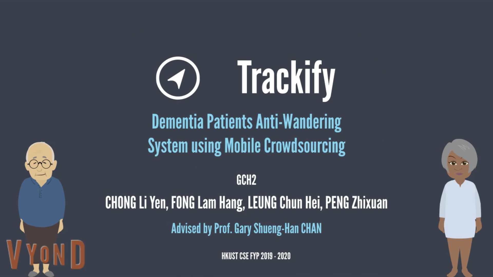
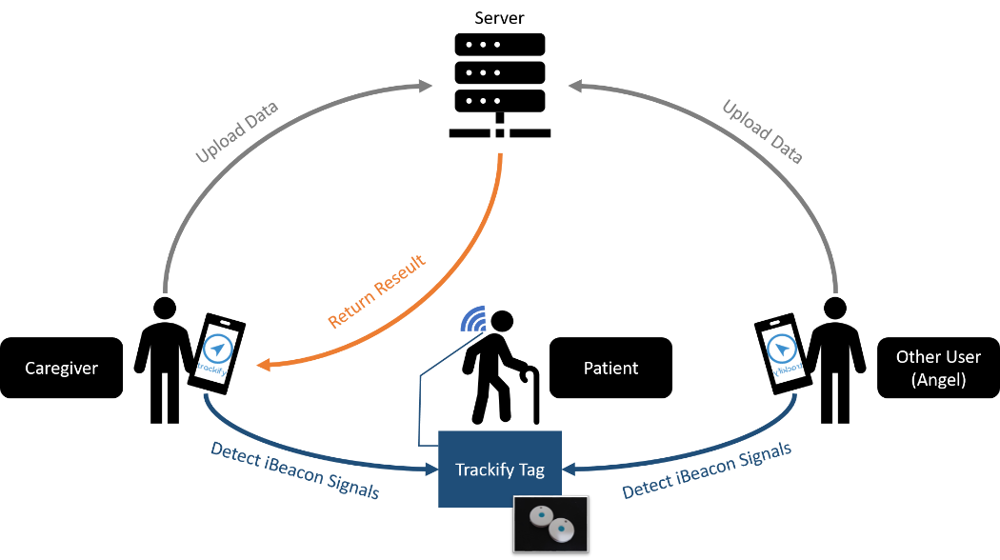
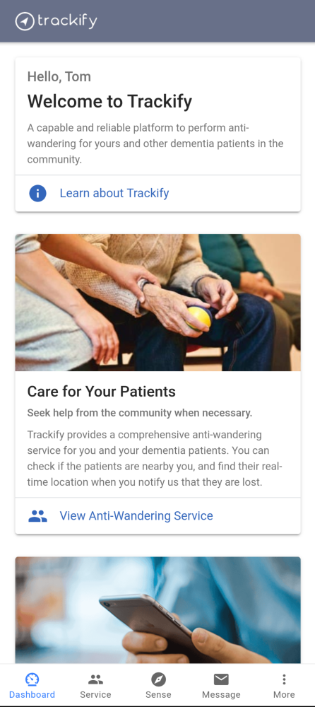
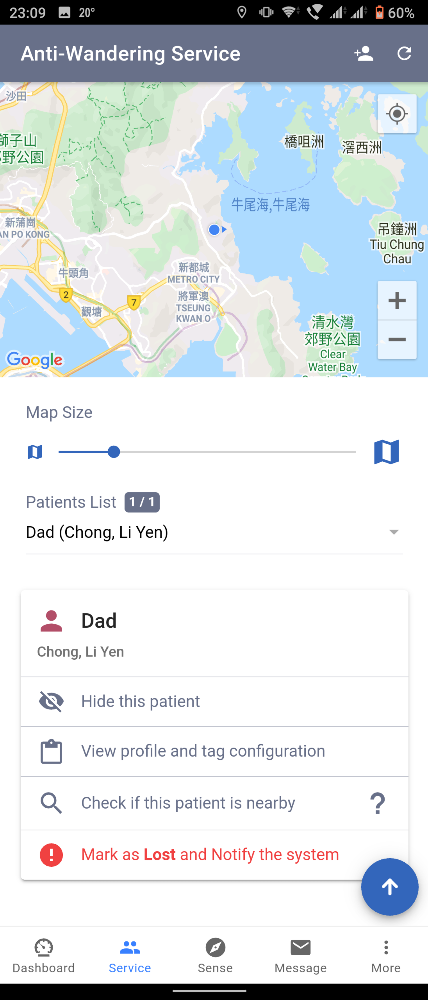
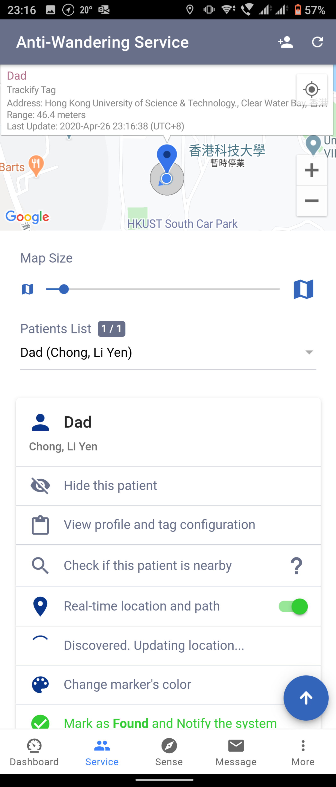
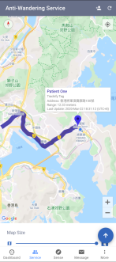
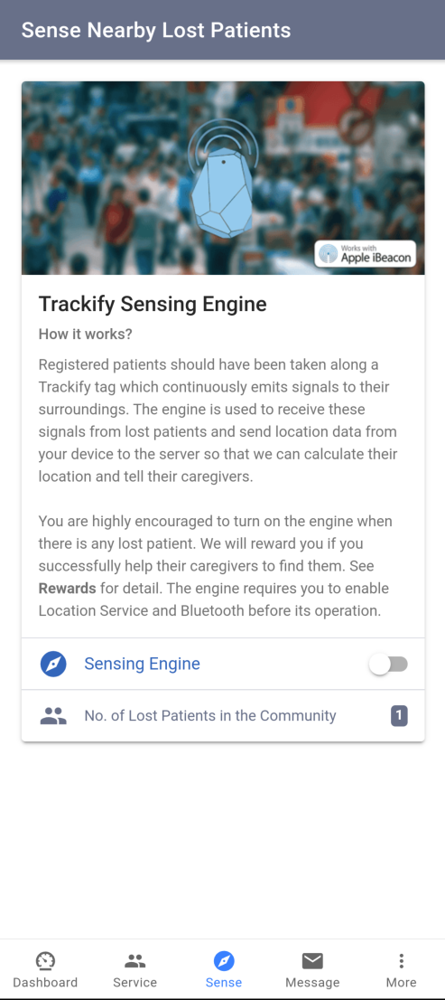
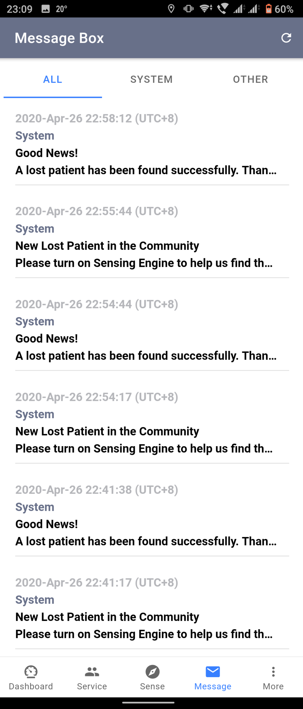

# Trackify Overview

This is the overview of "Dementia Patients Anti-Wandering System using Mobile Crowdsourcing", namely Trackify, a Computer Science and Engineering Final Year Project of The Hong Kong University of Science and Technology in 2019-2020.

## Introduction

- Introduction Video:

Hong Kong, similar to many cities in the world, is facing progressive population ageing that brings many challenges to our society. One of the generally recognized issues is the dementia, a brain disease commonly occurred in the aged group, hence the demand for anti-wandering of dementia people. There are some solutions like GPS tracking device to serve the purpose, though, they are not adequate to meet the need due to the following limitations:

1. Short service time due to short recharge cycle,
2. High dependence on single data source (i.e. GPS), and
3. Inconvenient maintenance and usage.

Our project mainly develops a reliable dementia patients anti-wandering system, namely Trackify. It is a solution using a newly rising data sourcing model – mobile crowdsourcing to implement anti-wandering in which we outsource part of the localization task to our userbase. We build a fully functional system that involves a mobile app, a web portal and a backend system with the use of iBeacon technology.

By using Trackify, people can be served an anti-wandering service with higher capability to urban environments, more durable operations, and less inconvenience, meanwhile they can contribute to helping other caregivers by sensing the lost patients in the community.

## Methodology

The idea of using mobile crowdsourcing is to outsource part of the work to our users, turning their mobile device to a medium of providing service and collecting data. How Trackify locates the patients and perform anti-wandering is relied on the computation of the data crowdsourced from their mobile devices.

The patients have to take along with an iBeacon tag. When their caregivers notify the system that their patients are lost, the app we provided to users can detect the beacon signals from the lost patients and upload their location information (e.g. GPS data) provided by their phones so that the system can locate the patient based on these data. Once the system successfully complete its computation, the resulting location will be displayed on the map in the app so that the caregivers can perform anti-wandering.

People who are willing to help dementia patients and their caregivers can also use Trackify, as an Angel user, to help sensing the lost patients.

## System Architecture

## Development Tools

- Mobile App: Ionic Framework
- Web Portal: Ionic Framework
- Backend: Go Language
- Database: MongoDB
- Other Technologies: iBeacon, Firebase

## Screenshots

      

## Project Information

##### Topic Full Name

- Dementia Patients Anti-Wandering System using Mobile Crowdsourcing

##### Project ID

- GCH2

##### Supervisor

- Prof. Gary Shueng-Han CHAN

##### Team Members

- CHONG Li Yen (https://github.com/lychongaa)
- FONG Lam Hang (https://github.com/tomfong)
- LEUNG Chun Hei (https://github.com/chleungao)
- PENG Zhixuan (https://github.com/PengZhixuan)

